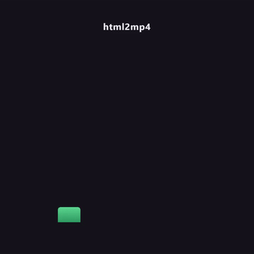

# html2mp4

Record a self-contained HTML animation to MP4 through the real Chrome compositor.

Point it at an HTML file that animates on load. You get back a video.



That GIF is `example/bars.html` recorded by this tool, converted to GIF for the README. Note the smooth easing: no dropped or repeated animation frames, which is the whole point (see below).

```bash
npm install
node record.js example/bars.html --out bars.mp4 --width 720 --height 720 --duration 4
```

Requires Node 18+ and `ffmpeg` on your PATH.

## Why not screenshot in a loop

The obvious implementation is `for each frame: page.screenshot()`. It produces judder.

`page.screenshot()` forces a synchronous paint on every call. That paint blocks the main thread, so `requestAnimationFrame` callbacks and CSS animations advance in uneven jumps between captures. The frames you get back are real, but they are not evenly spaced in animation time, and playing them at a fixed frame rate makes the motion stutter.

This tool uses `Page.startScreencast` over the Chrome DevTools Protocol instead. That subscribes to frames the compositor is *already* producing for the on-screen window, so the page runs at true wall-clock speed and nothing on the timeline is stalled by the capture.

The tradeoff: screencast frames arrive whenever the compositor emits them, at irregular intervals and not necessarily at your target frame rate. So the second half of the job is resampling. Each output slot at `i / fps` takes the most recent captured frame at or before that timestamp, which reconstructs an even grid from an uneven stream.

## Why `headless: false`

Headless Chrome throttles animation frames hard, especially for a backgrounded page, and can drop to a few frames per second. A real browser window does not. The window is launched at `--window-position=-2400,-2400`, off the edge of the desktop, so it renders normally without appearing on screen.

This means the tool needs a real display session. It will not work over a bare SSH connection without `xvfb-run` or an equivalent.

## Options

| flag | default | meaning |
|---|---|---|
| `--out <file>` | `out.mp4` | output path |
| `--width <px>` | `1080` | viewport width |
| `--height <px>` | `1920` | viewport height |
| `--fps <n>` | `30` | output frame rate |
| `--duration <sec>` | `5` | seconds to record |
| `--wait <selector>` | none | wait for this selector before recording |
| `--hide <selector>` | none | `display:none` these elements before recording (playback controls, debug overlays) |
| `--keep-frames` | off | leave the intermediate JPEGs in `.frames/` |

## Notes

- The page is loaded over `file://` with `--allow-file-access-from-files`, so local fonts, images and scripts referenced relative to the HTML all resolve.
- Recording starts as soon as the page is loaded and `--wait` is satisfied. If your animation has a lead-in you do not want, either delay it in CSS or trim the result.
- Arguments are validated before Chrome starts: a missing input file, a missing option value, and a non-positive or non-numeric `--fps` / `--duration` / `--width` / `--height` all fail immediately with one line of explanation. Without that check a typo'd filename records a few seconds of Chrome's own "file not found" page, which looks like a successful run.
- Audio is not captured. Mux it in afterwards with ffmpeg.
- Frames are JPEG at quality 92 and the encode is `libx264 -crf 18`, which is visually lossless for typical motion-graphics content. For flat-colour graphics you can push `-crf` lower by editing the ffmpeg call.

## Tests

```bash
npm test
```

Covers argument parsing and validation. The recording path itself needs a display session and `ffmpeg`, so it is exercised with `npm run example`.

## License

MIT
